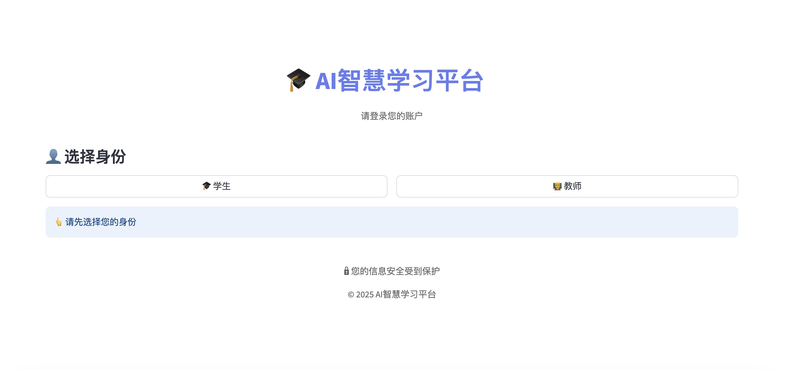
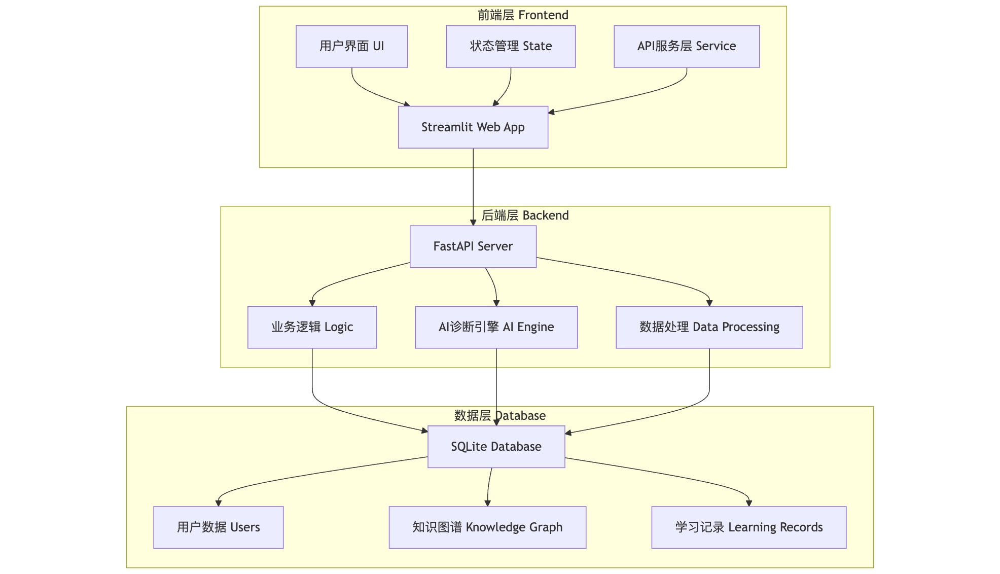

<div align="center">

# 🎓 AI智慧学习平台



[](https://python.org) [](https://fastapi.tiangolo.com) [](https://streamlit.io) [](https://sqlite.org)

### 🚀 基于AI驱动的个性化学习平台，助力教育数字化转型

**✨ 智能诊断 • 📊 数据驱动 • 🎯 个性化推荐 • 🗺️ 知识图谱可视化**

---

[🎯 核心特性](#-核心特性) • [🚀 快速开始](#-快速开始) • [📖 API文档](#-api文档) • [🤝 贡献指南](#-贡献指南)

</div>

---

## 📖 项目简介

**AI智慧学习平台** 是一个现代化的教育科技解决方案，采用前后端分离架构，为学生提供个性化学习体验，为教师提供智能教学管理工具。平台集成了AI答案诊断、知识图谱可视化、个性化推荐等前沿技术，致力于提升学习效率和教学质量。

### 🎯 设计理念

- **🤖 AI驱动**: 智能诊断、个性化推荐、自适应学习路径
- **📊 数据驱动**: 基于学习数据的精准分析和决策支持
- **🎨 用户体验**: 直观友好的界面设计，流畅的交互体验
- **🔧 技术先进**: 现代化技术栈，高性能、高可扩展性
- **📱 响应式**: 支持多设备访问，随时随地学习

---

## ✨ 核心特性

### 🎓 学生端功能

<table>
<tr>
<td width="50%">

#### 🏠 学习首页
- 📊 **学习概览**: 显示学习进度和掌握度统计
- 📈 **雷达图分析**: 可视化展示各知识模块掌握情况
- 📋 **快速导航**: 便捷访问各功能模块

#### 🎯 推荐任务
- 🤖 **智能推荐**: AI分析学习历史，推荐最适合的学习内容
- 📚 **新知识学习**: 根据学习路径推荐新知识点
- 💪 **技能强化**: 针对薄弱环节的强化练习
- 🔄 **错题复习**: 智能安排错题回顾和巩固

#### 🎮 自由练习
- 🗺️ **知识图谱**: 可视化知识点关系和掌握度
- 🎯 **点击练习**: 选择知识点开始对应练习
- 🤖 **实时诊断**: AI智能诊断答案，提供详细反馈
- 📊 **即时更新**: 根据答题情况实时更新掌握度

</td>
<td width="50%">

#### 🗺️ 知识图谱
- 🌐 **交互式图谱**: D3.js驱动的可视化知识网络
- 📊 **掌握度展示**: 不同颜色表示掌握程度
- 🔍 **节点详情**: 点击查看知识点详细信息
- 📈 **学习路径**: 清晰展示知识点间的依赖关系

#### ❌ 错题集
- 📝 **错题记录**: 自动收集答错的题目
- 🔄 **重做练习**: 支持错题重新练习
- 📊 **错误分析**: 分析错误类型和知识点分布

</td>
</tr>
</table>

### 👨‍🏫 教师端功能

<table>
<tr>
<td width="50%">

#### 📚 知识点管理
- ✏️ **CRUD操作**: 创建、编辑、删除知识点
- 🎚️ **属性设置**: 设置知识点难度、学科、年级等属性
- 🔍 **搜索过滤**: 按名称、难度、学科等条件筛选
- 📊 **统计分析**: 知识点数量和难度分布统计
- 🤖 **AI辅助**: 智能生成学习目标和描述

#### 📝 题目管理
- 📋 **多题型支持**: 选择题、填空题、解答题等
- 🖼️ **图片上传**: 支持题目配图上传和管理
- 🏷️ **知识点关联**: 将题目关联到相应知识点
- 🔄 **状态管理**: 草稿和已发布状态切换
- 📊 **题目统计**: 题目数量和类型分布分析

</td>
<td width="50%">

#### 🕸️ 知识图谱构建
- 🎨 **可视化编辑**: 交互式知识图谱构建界面
- 🔗 **关系管理**: 支持前置、包含、相关等关系类型
- 👁️ **实时预览**: 动态展示图谱结构变化

</td>
</tr>
</table>

---

## 🏗️ 技术架构

### 系统架构图




### 🛠️ 技术栈

<table>
<tr>
<td width="50%">

**🎨 前端技术栈**
- **Streamlit 1.46+** - 快速构建交互式Web应用
- **Python 3.13+** - 主要编程语言
- **D3.js** - 知识图谱可视化
- **Pandas** - 数据处理与分析
- **Plotly** - 数据可视化图表
- **CSS3** - 自定义样式与响应式设计

</td>
<td width="50%">

**⚙️ 后端技术栈**
- **FastAPI 0.115+** - 高性能异步API框架
- **SQLite** - 轻量级关系型数据库
- **Pydantic** - 数据验证与序列化
- **Uvicorn** - ASGI高性能服务器
- **Python-multipart** - 文件上传支持
- **Neo4j** - 图数据库支持（可选）

</td>
</tr>
</table>

### 🏛️ 架构优势

- **🔄 前后端分离**: 独立开发、部署、扩展，技术栈灵活
- **🛠️ 服务层设计**: 统一接口封装，错误处理，模拟服务支持
- **📦 模块化设计**: 角色分离，页面模块化，API模块化
- **🗄️ 数据库设计**: 关系型设计，支持复杂查询和事务
- **🤖 AI集成**: 智能诊断，个性化推荐，易于扩展

---

## 📁 项目结构

```
unveiling-the-list/
├── 📁 frontend/                    # 🎨 前端应用
│   ├── 🚀 app.py                  # 主应用入口
│   ├── ⚙️ config.py               # 配置和样式
│   ├── 📁 components/             # 🧩 组件模块
│   │   ├── login.py              # 登录组件
│   │   └── question_practice.py  # 练习组件
│   ├── 📁 services/               # 🔧 服务层
│   │   ├── api_service.py        # API服务封装
│   │   └── api_service.py        # API服务封装
│   └── 📁 pages/                  # 📄 页面模块
│       ├── 📁 student/            # 🎓 学生端页面
│       │   ├── home.py           # 学习首页
│       │   ├── recommended_tasks.py # 推荐任务
│       │   ├── free_practice.py  # 自由练习
│       │   ├── knowledge_map.py  # 知识图谱
│       │   └── wrong_questions.py # 错题集
│       └── 📁 teacher/            # 👨‍🏫 教师端页面
│           ├── knowledge_management.py      # 知识点管理
│           ├── question_management.py       # 题目管理
│           └── knowledge_graph_builder.py   # 知识图谱构建
├── 📁 backend/                     # ⚙️ 后端API服务器
│   ├── 🚀 api_server_restructured.py # FastAPI服务器
│   ├── 🔧 init_database.py        # 数据库初始化
│   ├── 📄 requirements.txt        # 后端依赖
│   ├── 📁 uploads/                # 📁 文件上传目录
│   └── 📁 api/                    # 🔌 API模块
│       ├── 📁 common/             # 🔧 通用模块（系统、用户、数据库）
│       ├── 📁 student/            # 🎓 学生端API（推荐、诊断、图谱、题目、统计）
│       └── 📁 teacher/            # 👨‍🏫 教师端API（知识管理、题目管理、数据分析）
├── 📁 data/                       # 🗄️ 数据文件
│   ├── my_database.db            # SQLite数据库
│   ├── create_tables.sql         # 数据库表结构
│   └── import_data.py            # 数据导入脚本
├── 📁 test/                       # 🧪 测试文件
├── 🚀 start_system.py             # 系统启动脚本（静默模式）
├── 🚀 start_system_verbose.py     # 系统启动脚本（详细输出）
├── 📄 pyproject.toml              # 项目配置文件
└── 📖 README.md                   # 项目说明
```

---

## 🚀 快速开始

### 📋 环境要求

- **Python**: 3.13+ 🐍
- **操作系统**: Windows / macOS / Linux 💻
- **内存**: 建议 4GB+ 🧠
- **磁盘空间**: 500MB+ 💾

### 🔧 手动启动

<details>
<summary>点击展开详细步骤</summary>

#### 1️⃣ 安装依赖

```bash
# 方式一：使用 uv（推荐）
pip install uv
uv sync

# 方式二：使用 pip
pip install -r backend/requirements.txt
```

#### 2️⃣ 启动后端

```bash
cd backend
python init_database.py          # 初始化数据库
python api_server_restructured.py # 启动API服务器
```

#### 3️⃣ 启动前端（新终端）

```bash
cd frontend
streamlit run app.py --server.port 8501
```

</details>

### 🌐 访问地址

启动成功后，您可以通过以下地址访问系统：

| 🎯 服务 | 🔗 地址 | 📝 说明 |
|---------|---------|----------|
| 🎨 **前端应用** | http://localhost:8501 | 学生和教师界面 |
| ⚙️ **后端API** | http://localhost:8000 | RESTful API服务 |
| 📚 **API文档** | http://localhost:8000/docs | 交互式API文档 |
| 🔍 **健康检查** | http://localhost:8000/health | 系统状态检查 |

### 👥 默认用户账号

| 👤 用户名 | 🎭 角色 | 📝 说明 |
|-----------|---------|----------|
| 小崔 | 🎓 学生 | 学生端功能演示，包含丰富的学习数据 |
| 小陈 | 🎓 学生 | 学生端功能演示，不同的学习进度 |
| 舵老师 | 👨‍🏫 教师 | 教师端功能演示，可管理知识点和题目 |

---

## 📖 API文档

本平台提供完整的RESTful API接口，支持学生端和教师端的所有功能。API采用角色分离设计，提供高性能的服务支持。

### 📚 文档资源

<div align="center">

| 📋 文档类型 | 🔗 访问地址 | 📝 说明 |
|-------------|-------------|----------|
| **🔗 交互式API文档** | [http://localhost:8000/docs](http://localhost:8000/docs) | Swagger UI，支持在线测试 |
| **📄 完整API文档** | [API_DOCUMENTATION.md](API_DOCUMENTATION.md) | 详细的API接口说明文档 |
| **🔍 API信息接口** | [http://localhost:8000/api-info](http://localhost:8000/api-info) | 获取API结构信息 |
| **💚 健康检查** | [http://localhost:8000/health](http://localhost:8000/health) | 系统状态检查 |

</div>

### 🎯 API特性

- **🔄 角色分离**: 学生端(`/student/`)和教师端(`/teacher/`)接口完全分离
- **📊 功能完整**: 涵盖智能推荐、答案诊断、知识图谱、题目管理等核心功能
- **🖼️ 多模态支持**: 支持文本和图片答案诊断
- **⚡ 高性能**: 基于FastAPI的异步处理，支持高并发访问
- **📝 标准化**: 统一的请求响应格式和错误处理机制
- **🤖 AI集成**: 集成智能推荐算法和答案诊断功能

> 💡 **提示**: 建议开发者优先查看交互式API文档进行接口测试，详细的接口说明请参考完整API文档。

---

## 🐛 故障排除

<details>
<summary>🔧 常见问题及解决方案</summary>

### 🔌 后端连接问题

**问题**: 前端显示"后端API连接失败"

```bash
# 检查后端服务状态
curl http://localhost:8000/health

# 查看端口占用情况
lsof -i :8000

# 重启后端服务
cd backend
python api_server_restructured.py
```

### 🌐 前端访问问题

**问题**: 无法访问 http://localhost:8501

```bash
# 检查Streamlit进程
ps aux | grep streamlit

# 查看端口占用
lsof -i :8501

# 重启前端服务
cd frontend
streamlit run app.py --server.port 8501
```

### 🗄️ 数据库问题

**问题**: 数据库连接错误或数据缺失

```bash
# 检查数据库文件
ls -la data/my_database.db

# 重新初始化数据库
cd backend
python init_database.py

# 检查数据库内容
sqlite3 ../data/my_database.db ".tables"
```

### 📦 依赖问题

**问题**: 模块导入错误

```bash
# 重新安装依赖
pip install -r backend/requirements.txt

# 或使用 uv
uv sync

# 检查Python版本
python --version  # 需要 3.13+
```

</details>

---

## 🧪 测试

### 🔬 运行测试

```bash
# 运行所有测试
python -m pytest test/

# 运行特定测试
python test/test_api.py
python test/test_database.py
python test/check_data_info.py
```

### 📊 测试覆盖

- ✅ **API测试**: 覆盖所有API接口
- ✅ **数据库测试**: 测试数据库操作和约束
- ✅ **集成测试**: 测试前后端集成功能
- ✅ **性能测试**: 关键功能的性能测试

---

## 🤝 贡献指南

### 🚀 参与贡献

1. **🍴 Fork项目**: 点击右上角Fork按钮
2. **📥 克隆仓库**: `git clone https://github.com/your-username/unveiling-the-list.git`
3. **🌿 创建分支**: `git checkout -b feature/new-feature`
4. **💻 开发功能**: 按照开发规范进行开发
5. **🧪 测试验证**: 确保所有测试通过
6. **📝 提交代码**: `git commit -m "Add new feature"`
7. **🚀 推送分支**: `git push origin feature/new-feature`
8. **🔄 创建PR**: 在GitHub上创建Pull Request

### 📝 提交规范

```bash
# 提交信息格式
type(scope): description

# 示例
feat(student): add knowledge map interaction
fix(api): resolve database connection issue
docs(readme): update installation guide
```

### 🔍 代码审查

- ✅ 所有PR需要经过代码审查
- ✅ 确保代码符合项目规范
- ✅ 添加必要的测试用例
- ✅ 更新相关文档

---

## 📊 项目统计

<div align="center">

| 📈 指标 | 📊 数值 |
|---------|----------|
| **开发语言** | Python 3.13+ |
| **代码行数** | 约 8000+ 行 |
| **API接口** | 25+ 个 |
| **功能模块** | 学生端4个，教师端3个 |
| **数据表** | 8个核心表 |
| **推荐算法** | 3种智能推荐策略 |

</div>


---

## 📞 联系方式

<div align="center">

### 🛠️ 技术支持

📧 **邮箱**: 1522518cui@gmail.com
🐛 **问题反馈**: [GitHub Issues](https://github.com/CQUPT-CZL/Dynamic-Tutor/issues)  
💬 **讨论交流**: [GitHub Discussions](https://github.com/CQUPT-CZL/Dynamic-Tutor/discussions)

### 👨‍💻 开发团队

**项目负责人**: czl 
**项目开始**: 2025年

---

### 🎓 AI智慧学习平台 v2.0

**🚀 让学习更智能，让教育更高效！**

[](https://github.com/CQUPT-CZL/Dynamic-Tutor)
[](https://github.com/CQUPT-CZL/Dynamic-Tutor)
[](https://github.com/CQUPT-CZL/Dynamic-Tutor/issues)

**如果这个项目对您有帮助，请给我们一个 ⭐ Star！**

</div>
